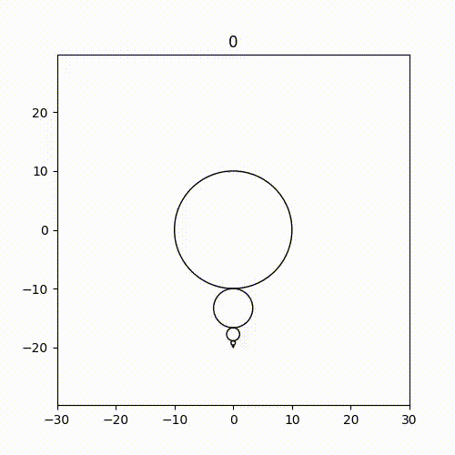

# FractalSpirograph
Drawing Fractal Spirograph patterns by rotating circles around each other.

This code is inspired by [this video](https://www.youtube.com/watch?v=0dwJ-bkJwDI&feature=youtu.be) by Daniel Schiffman from th coding train, who tried to imitate [this project](http://benice-equation.blogspot.com/2012/01/fractal-spirograph.html) from C. J. Chen. 

Here I recreate this fun fractal spirograph in python using numpy and matplotlib.

